= asciidocの書き方

こちらを参考に +
https://qiita.com/xmeta/items/de667a8b8a0f982e123a[Qiita]

= タイトル
== レベル１
=== レベル２
==== レベル３

= 文書のタイトル (Level 0)
== Level 1 Section Title
=== Level 2 Section Title
==== Level 3 Section Title
===== Level 4 Section Title

== 平日の過ごし方
=== 起床
4時過ぎに目がさめる。5時まで寝ている。

=== 運動
. ストレッチ
. 腕立て伏せ２０回
. 腹筋２０回
. スクワット２０回
. 自転車５分

=== 入浴

=== コードブロック
[source, rust]
----
fn main() {
    println!("Hello World!");
}
----

.表タイトル
[options="header"]
|=======================
|ID |商品名      |取引口座
|1    |Item 1     |a
|2    |Item 2     |b
|3    |Item 3     |c
|=======================

.ブロック
----
public class OutputServlet extends HttpServlet {
	private static final long serialVersionUID = 1L;
	@Resource(name = "jdbc/test")
	private DataSource ds;
	protected void doGet(HttpServletRequest request, HttpServletResponse response)
			throws ServletException, IOException {
		Connection con = null;
----

